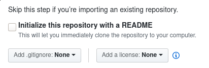

Title: How to fix "failed to push some refs" with new git repository
Date: 2020-02-22 16:35
Modified: 2020-10-18 14:16
Slug: failed_to_push_some_refs
Category: tech
Authors: Petri Salminen
Summary: Use `git pull --rebase` to fix "failed to push some refs" with new git repository.

I am currently working on my thesis at Tampere University. I have also worked as an course assistant on a course called Programmatic Content Management. On the course, there is a project work in which the students can receive complementary points for setting up a git repository for their project work. However, many students faced a problem, where they are unable to push to the repository.

## What lead to "failed to push some refs"?

Here are the commands, that were run and the error message that followed:

```shell
$ git init
# make work
$ git add
$ git commit
$ git remote add origin git@github.com/my-test-repo.git
$ git push remote master
To github.com:elguitar/my-test-repo.git
 ! [rejected]        master -> master (fetch first)
error: failed to push some refs to 'git@github.com:elguitar/my-test-repo.git'
hint: Updates were rejected because the remote contains work that you do
hint: not have locally. This is usually caused by another repository pushing
hint: to the same ref. You may want to first integrate the remote changes
hint: (e.g., 'git pull ...') before pushing again.
hint: See the 'Note about fast-forwards' in 'git push --help' for details.
```

Seems scary, right? The funny thing is, that the error did not happen in the commands above, but instead the reason for this is that the remote (Github) and the local (your laptop) have different git histories. Most probably the reason is that a README.md or LICENSE.md was generated by github during the repository initialization, which creates a new commit. See the picture below.



## Determining what's happening

Okay, so first we should figure out what is really happening. Let's start by updating the remote (github) commits to our local (laptop) repository:
```shell
$ git fetch origin # To know what is happening in remote
```

> Note: This does not affect your local branch. The difference between `git fetch` and `git pull` is that `git pull` performs an automatic merge

Now we can see what is happening in our repository by running `git log` with some interesting flags:
```shell
$ git log --all ---graph --parents
 commit 96e998e4798bcd2ae2f10bb0da3b981f68648cf4 (HEAD -> master)
  Author: Petri Salminen <petri@seravo.fi>
  Date:   Sat Feb 22 16:33:28 2020 +0200

      Add testfile

* commit 8b355573dccb5793279cc4dcaaf71d3de798a527 (origin/master)
  Author: Petri Salminen <petri@seravo.fi>
  Date:   Sat Feb 22 16:32:36 2020 +0200

      Initial commit

```

Above, we can see that the commits are separate. Neither of them have any parents. Therefore the history in origin is not the same as in your local repository. Git cannot know for sure if the "truth" is in your local repository or in the origin repository, which makes the `git push` fail.


## How to solve "failed to push some refs"

We should pull, but tell git that we want our local changes to be _rebased_ on the remote changes in origin. We can provide `--rebase` flag for `git pull` in order to achieve that:

```shell
$ git pull origin master --rebase
```

Now, everything should be okay! Let's use `git log` again to confirm that the origin and the local repositories share history:
```shell
$ git log --all --graph --parents
* commit 4d8c5a0dd9c11b289bef7ebb9c66b4ca8b8b814a 8b355573dccb5793279cc4dcaaf71d3de798a527 (HEAD -> master)
| Author: Petri Salminen <petri@seravo.fi>
| Date:   Sat Feb 22 16:33:28 2020 +0200
|
|     Add testfile
|
* commit 8b355573dccb5793279cc4dcaaf71d3de798a527 (origin/master)
  Author: Petri Salminen <petri@seravo.fi>
  Date:   Sat Feb 22 16:32:36 2020 +0200

      Initial commit

```

Now it is clear that the upper commit is a direct child of the Initial commit. Now the history is the same: both have the Initial commit and push should push the testfile commit to the origin as wanted.

Thanks for reading!
